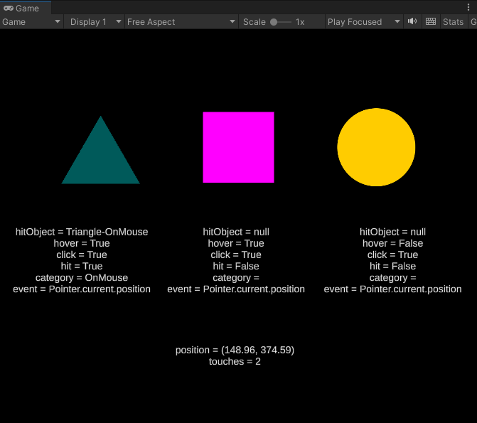
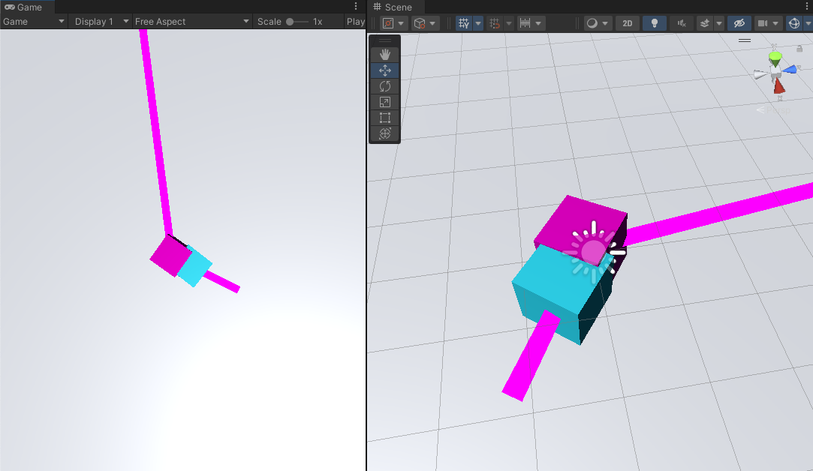
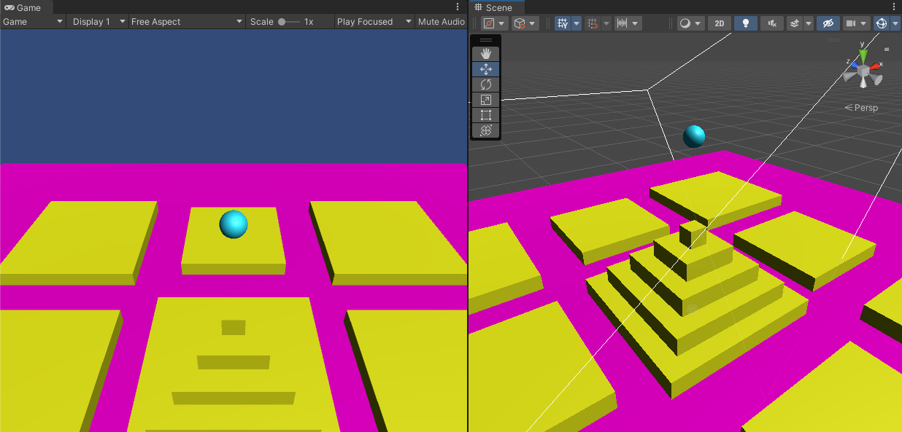

# dig250-unity-interaction

A sample Unity (2021.2.10f1) project with:

## InputsComparison

A simple comparison of Unity input types includes:

1. "OnMouse"     (old)   e.g. OnMouseDown() listeners
2. "InputLegacy" (older) e.g. Input.GetMouseButtonDown(0) 
3. "InputSystem" (new)   e.g. Mouse.current.leftButton.wasPressed

Also shows an example of the ["Command" pattern](https://gameprogrammingpatterns.com/command.html), as each listener is routed to a "handler" function for outcomes.

## Move_Object 📌

- Add force on click
- Add force on throw (example of drag within 3D world)
- Show direction of trajectory with `lineRenderer`

## Unity_Input_System

- The player control code is just for testing (<a href="https://medium.com/codex/why-you-should-use-unitys-new-input-system-268773863c4">ref</a>), but shows potential uses of the InputSystem
- Toggle the two scripts on the player to test
- See <a href="https://docs.unity3d.com/Packages/com.unity.inputsystem@1.0/manual/Actions.html">InputActions</a> for more

